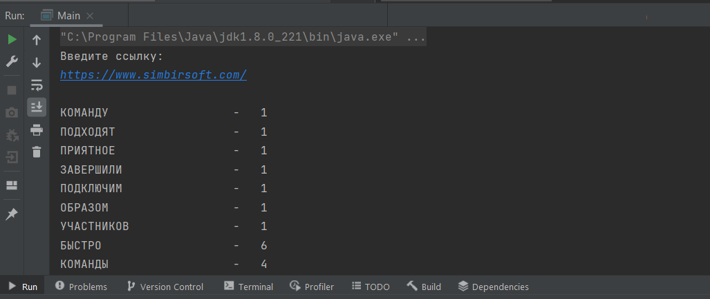

# Тествовое задание для SimbirSoft

Приложение принимает строку с адресом web-страницы, производит поиск и подсчёт уникальных слов, выводит их в консоль и записывает в базу данных.

Technologies that were used in this project:

• Java 8

• Maven

• Git

Connected libraries:

• JSoup

• PostgreSQL JDBC
